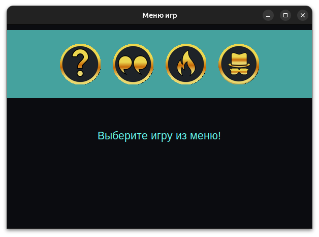
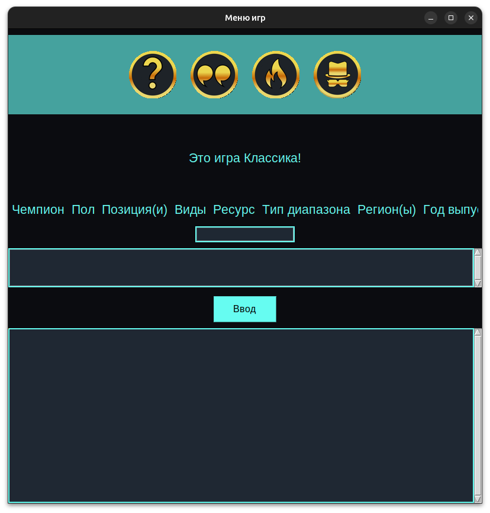
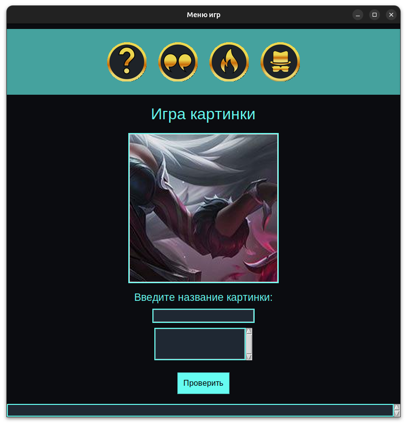

# Loldle - Desktop Game

**Loldle** — увлекательная игра для поклонников *League of Legends*, где вам нужно угадать чемпиона по подсказкам. Игра создана на Python и использует GUI для десктопных приложений.

## 🚀 Установка

### 1. Клонируйте репозиторий

Скачайте исходный код игры:

```bash
git clone https://github.com/enotika/loldle.git
```

### 2. Установите зависимости

Убедитесь, что у вас установлен Python 3.x. Для установки зависимостей используйте команду:

```bash
cd loldle
pip install -r requirements.txt
```

### 3. Запустите игру

После установки зависимостей, чтобы запустить игру, выполните:

```bash
python3 main.py
```

## 🎮 Как играть

- В **Loldle** вам нужно угадать чемпиона из *League of Legends*, опираясь на подсказки.
- Есть 4 вида игры для угадывания чемпиона с различными подсказками.
- При перезапуске окна загаданный чемпион меняется.

### Примеры игр:
#### Первая игра:
1. Вы вводите имя чемпиона и получаете подсказки какие из параметров угадали/угадали частично/не угадали.
2. Вводите имя чемпиона на основе подсказок.
3. При победе поле ввода блокируется и все параметры чемпиона будут выделены зеленым.

#### Вторая игра:
1. Вы получаете подсказку - цитату загаднного чемпиона.
2. Вводите имя чемпиона на основе подсказки.
3. При победе поле ввода блокируется и выводится сообщение о победе.

#### Третья игра:
1. Вы получаете подсказку - картинку способности загаданного персонажа(она черно-белая и случайно повернута).
2. Вводите имя чемпиона на основе подсказки.
3. При победе поле ввода блокируется и выводится сообщение о победе, картинка обретает цвет и правильный поворот и дается возможность выбрать какая способность загадана.
4. При выборе правильной способности кнопка окрасится в зеленый, иначе в красный, а в зеленый тогда окрасится правильный ответ.

#### Четвертая игра:
1. Вы получаете подсказку - часть сплеш-арта скина чемпиона.
2. Вводите имя чемпиона на основе подсказки.
3. При неправильной попытке часть сплеш-арта расширится(всего возможно увеличить картинку 20 раз, после она увеличиваться не будет).
4. При правильном ответе сплеш-арт откроется полностью.

## 🔧 Технические особенности

- **Язык:** Python 3.x
- **Библиотеки:** `Tkinter` (для GUI), `Pillow`
- **Режим игры:** Однопользовательский, с ежедневным обновлением чемпионов.
- **Платформы:** Поддерживает Windows и Linux.

## 📸 Скриншоты

Вот как выглядит интерфейс игры:







## 🛠️ Разработка

Если вы хотите внести свой вклад, следуйте этим шагам:

1. Форкните репозиторий.
2. Создайте новую ветку (`git checkout -b feature-name`).
3. Сделайте изменения и закоммитьте их.
4. Откройте Pull Request.

## 📜 Лицензия

Этот проект лицензируется под лицензией MIT. Подробнее см. файл [LICENSE](LICENSE).

## 📧 Контакты

Если у вас есть вопросы или предложения, пишите на: `angelinadubkova@gmail.com`.
